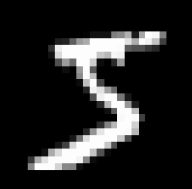

# MNIST-handwritten-kNN-model

This is my another model for classification of handwritten digits. Unlike before I didn't use neural network. I just wanted use simple Machine Learning algorithm named k-Nearest Neighbors. As you can see on notebook file it is simple to code.

Samples from train dataset:

  
  
  

I got ~96% accuracy on train dataset. I is quite good result for Machine Learning algorithm, but how this model perform on digits I wrote with Paint? Let's test it.

The images I drew:

  
  
  

As you know from the respository before that I wrote a function that takes images as input and prepares it for model. I used that function again. And we can see result of model. I got 50% accuracy. 

By the way, unlike before I used brush (Paint tool) for this model. Last time I used pencil. They are available on 'brush' directory.

While I was 3rd cell when I pressed run button to train model it didn't took even a second. That's why I printed the  wall times,  then I remembered kNN is lazy learner. :)
